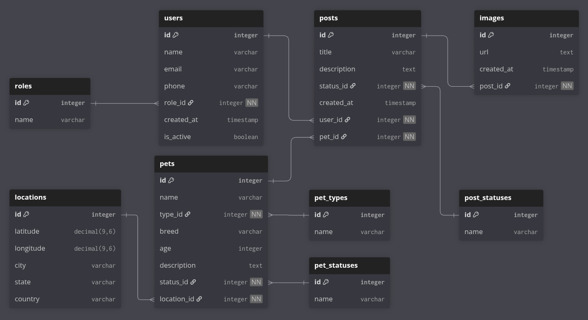

# 🐶🐱 Pet Adoption Platform - Database Schema

Este proyecto define la base de datos para una **plataforma social de adopción de mascotas**.  
El objetivo es que los usuarios puedan publicar mascotas que necesitan hogar, con fotos, ubicación y detalles, y que otros usuarios puedan verlas y contactarse.

---

## 📌 Modelo de Datos

El modelo está diseñado bajo **mejores prácticas modernas**:
- Usuarios nunca se eliminan físicamente → se marcan con `is_active = false`.
- Roles, tipos y estados se manejan en tablas normalizadas.
- Relaciones claras con claves foráneas y restricciones de integridad.
- Las mascotas tienen **ubicación** asociada, para poder mostrarlas en el mapa.

---

## 📊 Entidades principales

### 1. Users
Representa a los usuarios de la plataforma.
- `id`: Identificador único.
- `name`: Nombre completo.
- `email`: Correo electrónico único.
- `phone`: Teléfono de contacto.
- `role_id`: Relación con `roles`.
- `created_at`: Fecha de creación.
- `is_active`: Booleano para soft delete.

### 2. Roles
Define los tipos de usuario en la plataforma.  
Ejemplo:
- `ADMIN`
- `PUBLISHER` (puede publicar mascotas)
- `ADOPTER` (puede adoptar mascotas)

### 3. Locations
Representa la ubicación de una mascota.  
- `latitude`, `longitude`: coordenadas para mapas.  
- `city`, `state`, `country`: información legible de ubicación.  

Cada mascota está asociada a una ubicación.

### 4. Pets
Información sobre la mascota.
- `name`, `breed`, `age`, `description`
- `type_id`: Relación con `pet_types` (Dog, Cat, Other)
- `status_id`: Relación con `pet_statuses` (Available, Adopted)
- `location_id`: Relación con `locations`  

### 5. Posts
Publicaciones de adopción realizadas por usuarios.
- `title`, `description`
- `status_id`: Relación con `post_statuses` (Active, Closed)
- `user_id`: Relación con `users`
- `pet_id`: Relación con `pets`
- Cada post puede tener varias imágenes.

### 6. Images
Fotos asociadas a un post.
- `url`: Enlace a la imagen (almacenada en un servicio externo tipo S3/Cloudinary).
- `post_id`: Relación con `posts`.

### 7. Tablas de soporte
- `pet_types`: Dog, Cat, Other
- `pet_statuses`: Available, Adopted
- `post_statuses`: Active, Closed

---

## 🔗 Relaciones

- **Users 1—N Posts** → un usuario puede crear muchas publicaciones.
- **Posts 1—1 Pets** → cada publicación corresponde a una mascota.
- **Posts 1—N Images** → una publicación puede tener múltiples imágenes.
- **Pets 1—1 PetType** → cada mascota tiene un tipo.
- **Pets 1—1 PetStatus** → cada mascota tiene un estado (ej: disponible).
- **Posts 1—1 PostStatus** → cada post tiene un estado (ej: activo).
- **Pets 1—1 Location** → cada mascota tiene asociada una ubicación.

---

## 🔄 Flujo de uso (MVP)

1. Un usuario se registra vía Google Sign-In → se guarda en `users` con un `role` por defecto.
2. El usuario (si es `PUBLISHER`) crea una publicación:
   - Se crea un registro en `pets` con su `location`.
   - Se crea un registro en `posts` asociado al usuario y a la mascota.
   - Se suben imágenes → registros en `images`.
3. Otros usuarios (rol `ADOPTER`) pueden navegar publicaciones activas filtrando por ubicación.
4. Cuando una mascota es adoptada:
   - Se actualiza `pets.status_id = Adopted`.
   - Se actualiza `posts.status_id = Closed`.

---

## 🚀 Próximos pasos (más allá del MVP)

- Tabla `comments` para interacción social.
- Tabla `interests` para que un usuario exprese interés en adoptar.
- Manejo de auditoría (`updated_at`, `deleted_at`).
- Endpoints REST para la API (Go backend con arquitectura hexagonal).

---

## 📂 Archivos en este repo

- `schema.sql` → DDL con la creación de tablas en PostgreSQL.
- `schema.dbml` → Definición en DBML (para visualizar en dbdiagram.io).
- `diagram.png` → Diagrama ER exportado de dbdiagram.io.
- `README.md` → Este archivo, guía para entender el modelo.

---

---

## 🖼️ Diagrama Entidad–Relación (ERD)

Para complementar la explicación, este es el diagrama visual de las entidades y relaciones principales:

> El archivo fuente está en [`schema.dbml`](./schema.dbml) y puede visualizarse/editarse en [dbdiagram.io](https://dbdiagram.io/home).

---

## 👨‍💻 Equipo

Este README está pensado para que **todos los niveles del equipo** (trainee, semi, senior) puedan entender:
- Qué tablas existen.
- Cómo se relacionan.
- Qué flujo sigue el sistema.
