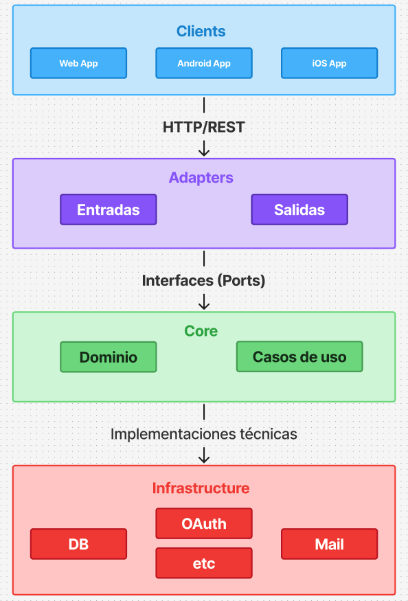

# ☁️ Infraestructura de Alto Nivel

La plataforma está organizada en una arquitectura cliente-servidor simple:

---

## 📌 Componentes principales

- **Clientes**
  - 🌐 Web App (frontend)
  - 📱 App Android
  - 🍎 App iOS

- **Backend**
  - Monolito en Go con arquitectura hexagonal.
  - Expone una API REST/HTTPS para clientes web y móviles.
  - Integración con **Google OAuth2** para autenticación.

- **Base de Datos**
  - PostgreSQL, donde se almacena la información del dominio (usuarios, mascotas, posts).

- **Almacenamiento**
  - Servicio externo o interno para imágenes (ej: S3, Cloudinary, o bucket propio).

- **Servidor**
  - Todo vive en un servidor propio de la organización.
  - QA y DevOps gestionan entornos de pruebas y despliegue continuo.

---

## 🖼️ Diagrama de Infraestructura

Para complementar la explicación, este es el diagrama visual de la infraestructura actual:


---

## 🚀 Próximos pasos

- Incorporar un **pipeline de CI/CD** desde GitHub Actions al servidor.
- Agregar un **ambiente de Staging** para QA.
- Incluir herramientas de **monitoring y logging** (ej: Grafana, Prometheus, ELK).
- Posible uso de **Load Balancer** (Nginx/Traefik) para escalar tráfico.


<br>
<br>
<br>

# ☁️ Arquitectura de Bajo Nivel

Este proyecto está desarrollado en **Go**, siguiendo una **arquitectura hexagonal** para garantizar una estructura **clara**, **desacoplada** y **fácil de escalar** a medida que evoluciona la plataforma.

---

## 🧭 Objetivo de la Arquitectura

El objetivo de esta arquitectura es mantener un sistema **modular**, **desacoplado** y **escalable**, donde la **lógica de negocio** esté completamente separada de frameworks, drivers o tecnologías externas.

Esto nos permite:
- 👥 Que varios equipos trabajen en paralelo sin interferirse.  
- 🔄 Reemplazar tecnologías (DB, OAuth, etc.) sin afectar el core.  
- 🧪 Testear la lógica central sin levantar infraestructura externa.  
- 🚀 Escalar funcionalidades sin generar dependencias rígidas.

---

## 🧱 Capas Principales

La arquitectura se organiza en **capas bien definidas**, cada una con una responsabilidad específica:

| Capa              | Responsabilidad Principal                                                                 |
|--------------------|-------------------------------------------------------------------------------------------|
| 🧠 **Core**        | Contiene el **dominio** y la **lógica de negocio** central (entidades, casos de uso, puertos). |
| 🔌 **Adapters**    | Actúan como traductores entre el mundo externo y el core. Incluye entradas (HTTP) y salidas (por ej. persistencia). |
| 🧰 **Infrastructure** | Implementa detalles técnicos concretos (DB, OAuth, SMTP, mailer, etc.) sin lógica de negocio. |
| 🌐 **Clients**     | Aplicaciones consumidoras: Mobile App, Web App, iOS App, Postman, etc. |

---

## 🔁 Flujo de Comunicación entre Capas

La comunicación entre capas fluye de forma **ordenada y controlada**:

1. 🌐 **Clients** → envían requests HTTP/REST.  
2. 🔌 **Adapters (entrada)** → reciben la request, validan y la traducen a un caso de uso del Core.  
3. 🧠 **Core** → aplica reglas de negocio y delega operaciones técnicas mediante interfaces (ports).  
4. 🧰 **Infrastructure** → implementa esas interfaces y ejecuta las operaciones reales (DB, OAuth, etc.).  
5. 🔌 **Adapters (salida)** → formatean la respuesta para el cliente.

👉 Esto evita mezclar responsabilidades y mantiene el core limpio.

---

## 📝 Diagrama

A continuación se muestra una vista general de la **arquitectura hexagonal** utilizada en el proyecto:



---

## 🗂️ Estructura de Carpetas

```bash
/cmd
  /api
    main.go                  → punto de arranque de la app (inyecciones, router)

/internal
  /auth                      → módulo de autenticación
    /adapter
      /http                  → handlers REST (login, register, verify, etc.)
      /google                → adapter OAuth2 Google
      /persistence           → repositorios (Postgres)
    /application             → casos de uso (servicios)
    /core                    → dominio puro (entidades + interfaces)

  /pets                      → módulo mascotas (posterior)
  /support                   → módulo soporte (posterior)

 /config                     → configuración global (env, DB, OAuth, etc.)
 /shared                     → utilidades comunes (logger, errores, middlewares)

```

💡 Cada módulo (`auth`, `pets`, etc.) es **autónomo** y cuenta con **capas internas propias**, evitando mezclar responsabilidades.  
📌 El **dominio nunca importa infraestructura** — al revés sí.

<br>

## 🧠 Roles de Cada Capa

| Capa           | Qué debe contener                                                       | Qué no debe contener                                          |
|---------------|--------------------------------------------------------------------------|----------------------------------------------------------------|
| **Core**      | Entidades, interfaces (ports), reglas de negocio                         | SQL, librerías externas, llamadas HTTP                        |
| **Adapters**  | Handlers HTTP, DTOs, parseo/validación, conversión de datos              | Lógica de negocio, acceso a DB                                |
| **Infrastructure** | Implementaciones técnicas (repositorios, clientes externos)        | Lógica de request/response, reglas de negocio                  |
| **Config/Shared**  | Setup global, middlewares, utilidades comunes                       | Lógica específica de un módulo                                |

📌 Esta tabla sirve como **guía para que todo el equipo mantenga la arquitectura consistente** a lo largo del desarrollo.

---

<br>


## 🚀 Roadmap Inicial — Módulo de Login

Para el primer sprint, nos enfocaremos en implementar el flujo de autenticación (local + Google):

1️⃣ **Crear estructura de carpetas base** en el repo.  

2️⃣ **Definir puertos** en `/internal/auth/core`.  

3️⃣ **Implementar casos de uso**:
- `Register` (registro + verificación por código)
- `Login` (local)
- `GoogleLogin` (OAuth2)

4️⃣ **Implementar adaptadores**:
- HTTP Handlers para login/register/verify  
- OAuth Adapter para Google  
- Repositorios en Postgres

5️⃣ **Armar wiring** en `cmd/api/main.go` (inyección de dependencias).  

6️⃣ **Escribir tests** unitarios para core y tests de integración para adapters.

---

<br>

## 📝 Recomendaciones para el Equipo

- 🚫 **No mezclar capas:** si necesitás acceder a la DB desde un handler, estás rompiendo la arquitectura.  
- 📁 **Seguir la estructura por módulo:** cada feature va en su módulo, con `adapter / application / core`.  
- 🧪 **Testear el core sin levantar infra:** usar *mocks* de interfaces.  
- 🧠 **Pensar en interfaces primero:** el core define qué necesita, la infraestructura decide cómo implementarlo.

---

<br>

## 📚 Glosario Rápido

| Término    | Definición breve                                                                 |
|-----------|-----------------------------------------------------------------------------------|
| **Port**      | Interfaz que define qué necesita el core de sus dependencias externas.             |
| **Adapter**   | Implementación concreta que traduce entre el mundo externo y el core.              |
| **Use Case**  | Lógica de negocio que coordina entidades y puertos para cumplir un objetivo.       |
| **Entity**    | Objeto del dominio con reglas propias (no DTOs).                                  |

