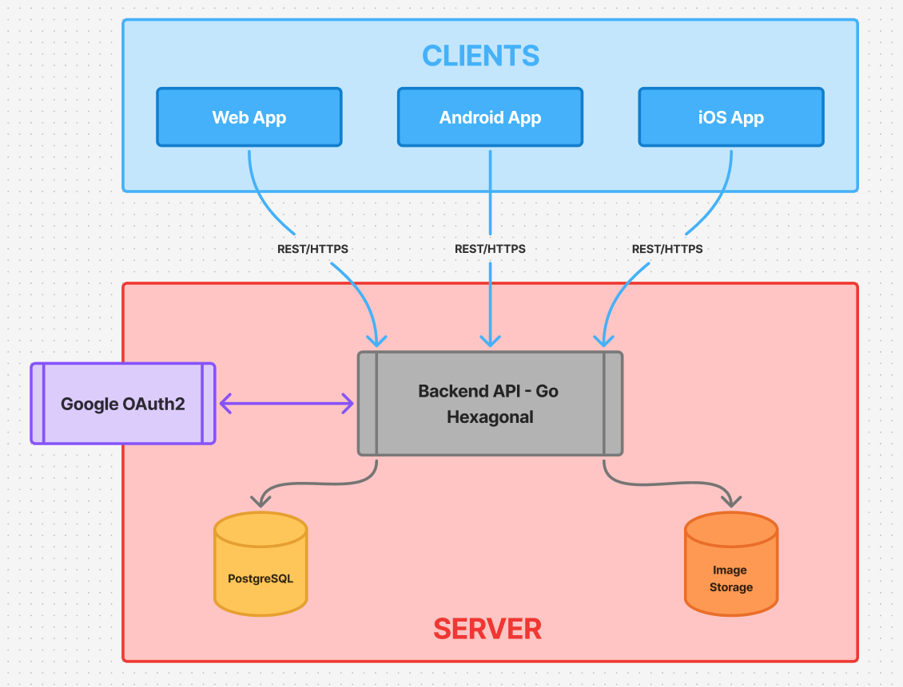

# ☁️ Infraestructura de Alto Nivel

La plataforma está organizada en una arquitectura cliente-servidor simple:

---

## 📌 Componentes principales

- **Clientes**
  - 🌐 Web App (frontend)
  - 📱 App Android
  - 🍎 App iOS

- **Backend**
  - Monolito en Go con arquitectura hexagonal.
  - Expone una API REST/HTTPS para clientes web y móviles.
  - Integración con **Google OAuth2** para autenticación.

- **Base de Datos**
  - PostgreSQL, donde se almacena la información del dominio (usuarios, mascotas, posts).

- **Almacenamiento**
  - Servicio externo o interno para imágenes (ej: S3, Cloudinary, o bucket propio).

- **Servidor**
  - Todo vive en un servidor propio de la organización.
  - QA y DevOps gestionan entornos de pruebas y despliegue continuo.

---

## 🖼️ Diagrama de Infraestructura

Para complementar la explicación, este es el diagrama visual de la infraestructura actual:

---

## 🚀 Próximos pasos

- Incorporar un **pipeline de CI/CD** desde GitHub Actions al servidor.
- Agregar un **ambiente de Staging** para QA.
- Incluir herramientas de **monitoring y logging** (ej: Grafana, Prometheus, ELK).
- Posible uso de **Load Balancer** (Nginx/Traefik) para escalar tráfico.

---
